# Speech Emotion Recognition System

This repository contains all components necessary to deploy a speech emotion recognition system to Google Cloud Platform (GCP) services. This system is designed to handle multiple tasks including data generation, data transformation, model training, model evaluation, model deployment, and serving the trained model. The workflows are orchestrated using Cloud Composer with detailed operations defined in respective Docker configurations and triggered via Cloud Run and Vertex AI.

This work is in continuation of the work done in [this](https://github.com/debanjansaha-git/speech-emotion-recognition) GitHub repository

## Repository Structure

- **dags/**: Contains Directed Acyclic Graphs (DAGs) used by Cloud Composer to manage and orchestrate tasks.
- **data_generation/**: Scripts, utilities and Docker configurations to generate or simulate new datasets. Artifacts are containerized and pushed to the Artifacts Registry.
- **data_transformation/**: Code to perform data preprocessing and feature extraction, including drift detection. Similar to data generation, it uses Docker for containerization.
- **model_deployment/**: Contains all necessary configurations for deploying the trained models using Vertex AI.
- **model_evaluation/**: Code for evaluating the models including environmental variables and Docker configurations for deployment.
- **model_serving/**: Handles the serving of the deployed models, with changes ensuring compatibility and functionality on local setups before deployment.
- **model_training/**: Training scripts, including parameter tuning and configuration management, packaged for Vertex AI Custom Training Jobs.

Utility Scripts
- **gcr_data_gen.sh**, **gcr_data_trans.sh**, **gcr_model_deploy.sh**, **gcr_model_eval.sh**, **gcr_model_serve.sh**, **gcr_model_train.sh**
  - Bash scripts for building and pushing Docker images to Google Cloud's Artifact Registry, specific to each component of the repository.

## Getting Started

To get started with this project, clone the repository to your local machine or server environment:

```bash
git clone git@github.com:akhilkn8/speech-emotion-detection-GCP.git
```

## Usage

Each folder is equipped with a Dockerfile and respective scripts that define how to build and deploy the services on GCP. Ensure you have the correct permissions and environment variables set before running these scripts.

### Instructions
Follow these steps to deploy any component:
- Start Docker deamon in your local system
- Authenticate to Google Cloud using SDK or commands
```bash
gcloud auth login
gcloud config set project <project-id>
gcloud auth configure-docker us-east1-docker.pkg.dev,us-east4-docker.pkg.dev
```
- Create the required Artifacts Repositories in GCP to store the container images as:
```bash
gcloud artifacts repositories create model-training --repository-format=docker \
--location=us-east1 --description="Docker repository for model training"
```
- Use the respective gcr_*.sh script to build and push the Docker image.
- Or you can also directly trigger Cloud Run jobs as:
```bash
gcloud run jobs describe <image-name> --format export > job.yaml
gcloud beta run jobs replace job.yaml  
gcloud beta run jobs execute <image-name>
```

- Ensure your Cloud Composer environment is properly configured to trigger the appropriate Cloud Run or Vertex AI job.

### Artifacts Registry

We store our docker containers in Artifacts Registry, in the following repositories 

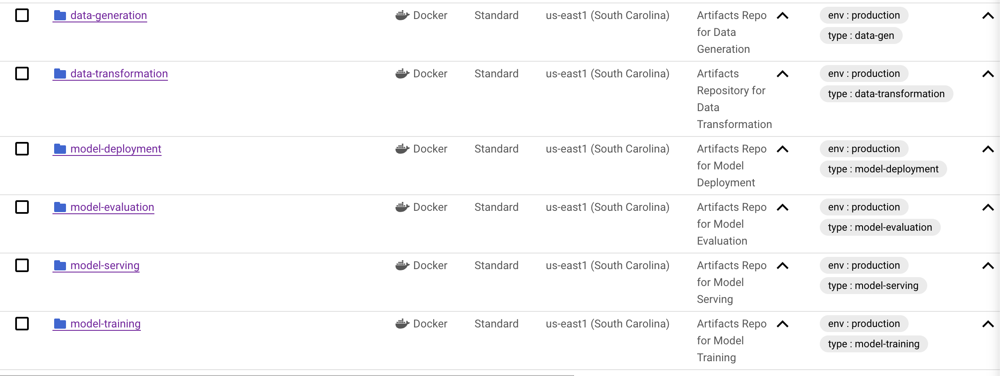

### Cloud Composer

Our entire MLOps orchestration is done using Cloud Composer, wherein we write various custom DAGs to trigger Cloud Run jobs (`CloudRunExecuteJobOperator`) or Vertex AI jobs (`CreateCustomContainerTrainingJobOperator`)

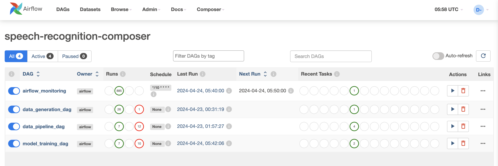

### Training Pipeline

We train our custom ML Models using Vertex AI Training Pipelines

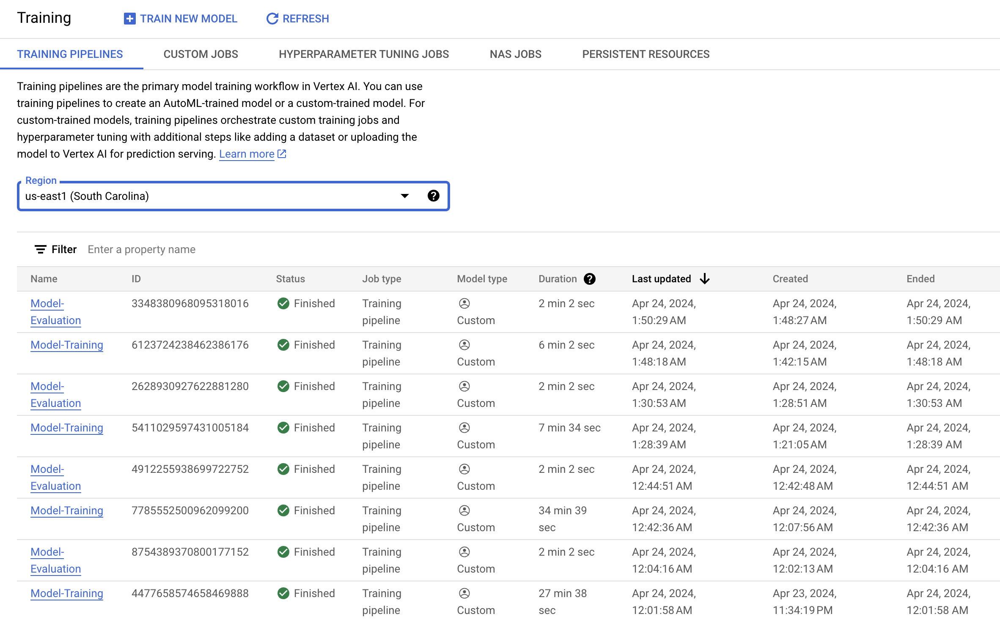

These are essentially custom jobs triggered through our Cloud Composer environment

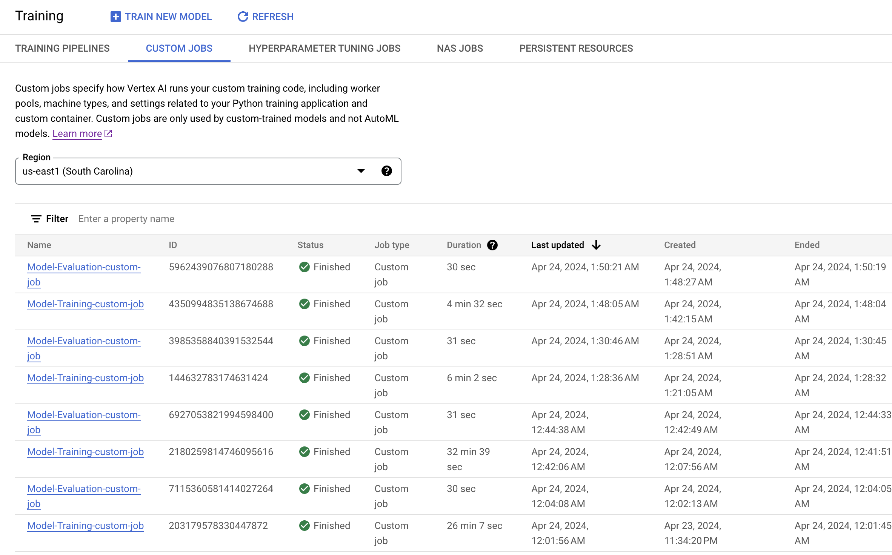

### Model Registry

We register our models into Vertex AI Model Registry and manage the state of the models as:
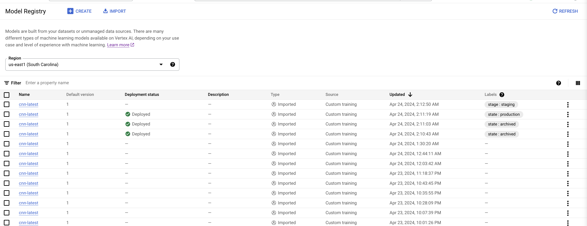

### Experiment Tracking

We track our experiments using Vertex AI Experiment tracking for:

1. Training Pipeline
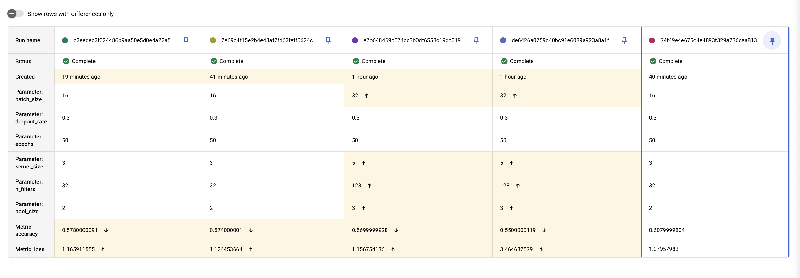

2. Evaluation Pipeline
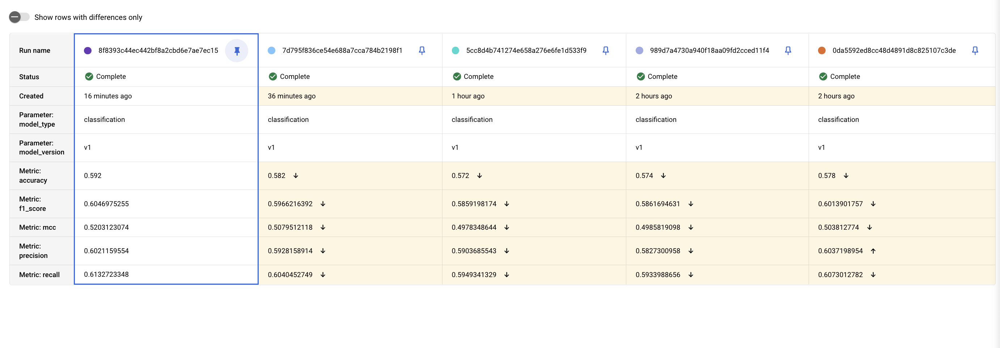

### Metadata Management
We also have a Vertex AI Metadata store to manage the model metadata as:
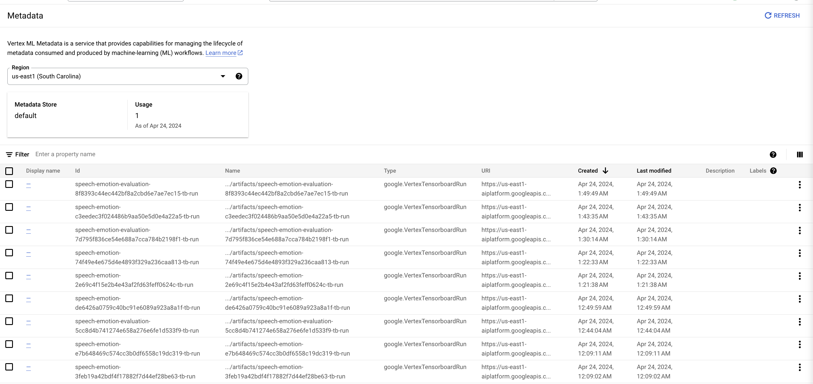

### Model Deployment

We deploy our models to our endpoint with provision of using deployment techniques like Canary Deployment:
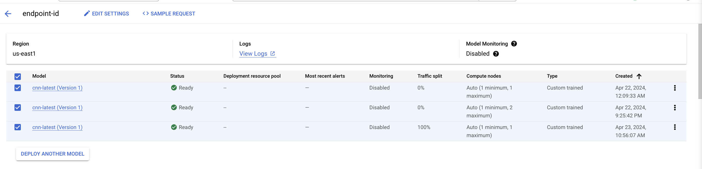

### Model Serving

We serve our models using Cloud Run Services and Streamlit Frontend. 

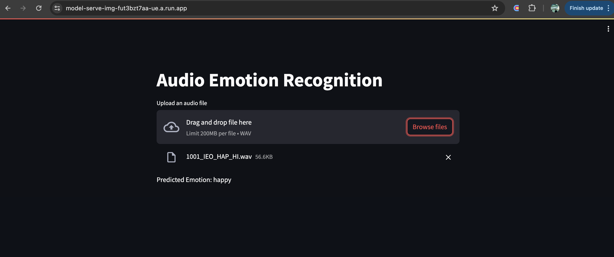

The deployment service health can be easily monitored as:
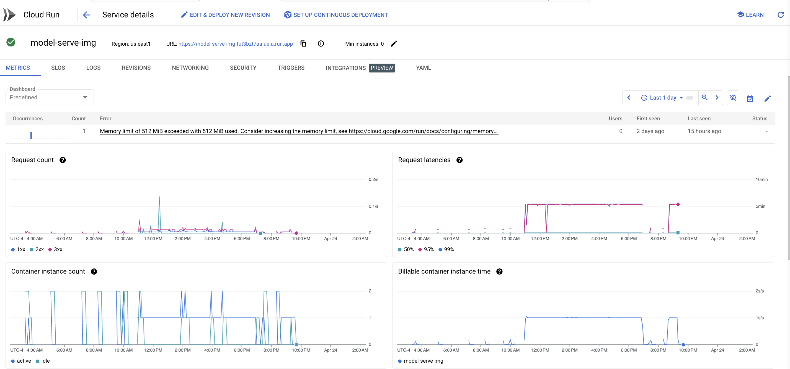
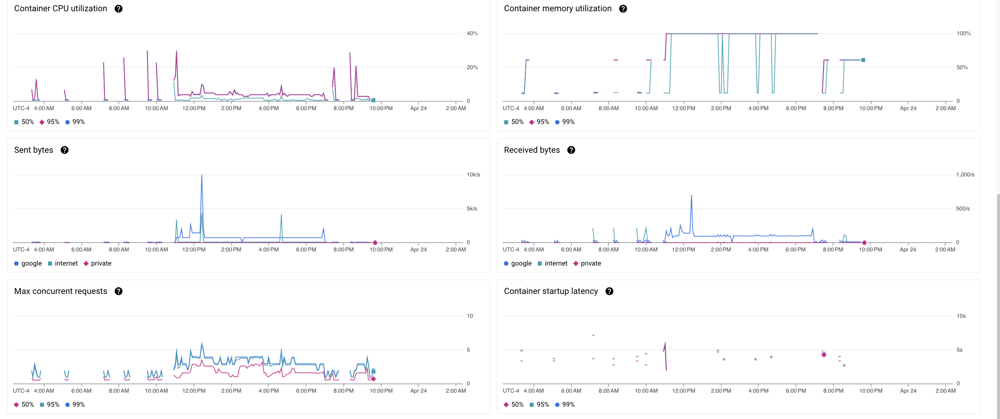


### Cluster Health Monitoring

We deploy our services through Cloud Compose running on Kubernetes backend. We can monitor the cluster health using managed services like Prometheus

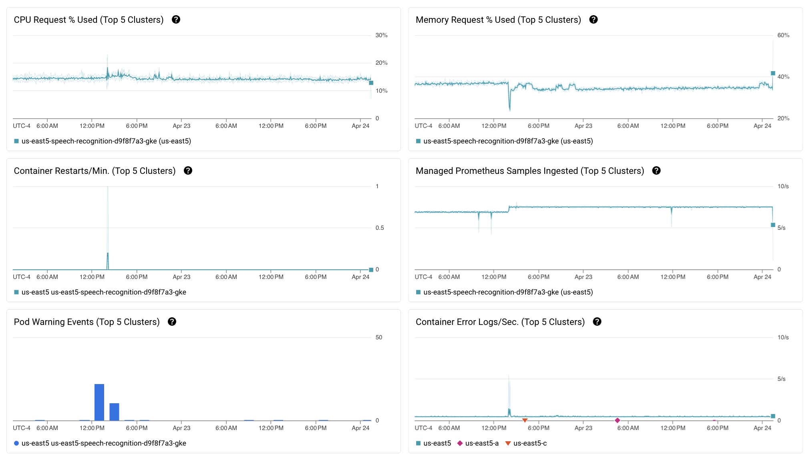


This setup ensures a scalable and manageable deployment of machine learning models, leveraging GCP's robust cloud infrastructure.


## Contributing
Contributions to this project are welcome. Please refer to the contribution guidelines before making a pull request. Ensure that any changes are well-documented and include updates to this README if necessary.

For more detailed instructions and configuration specifics, refer to the documentation within each module's directory.


## License
This project is licensed under the Apache License - see the [LICENSE](LICENSE) file for details.


